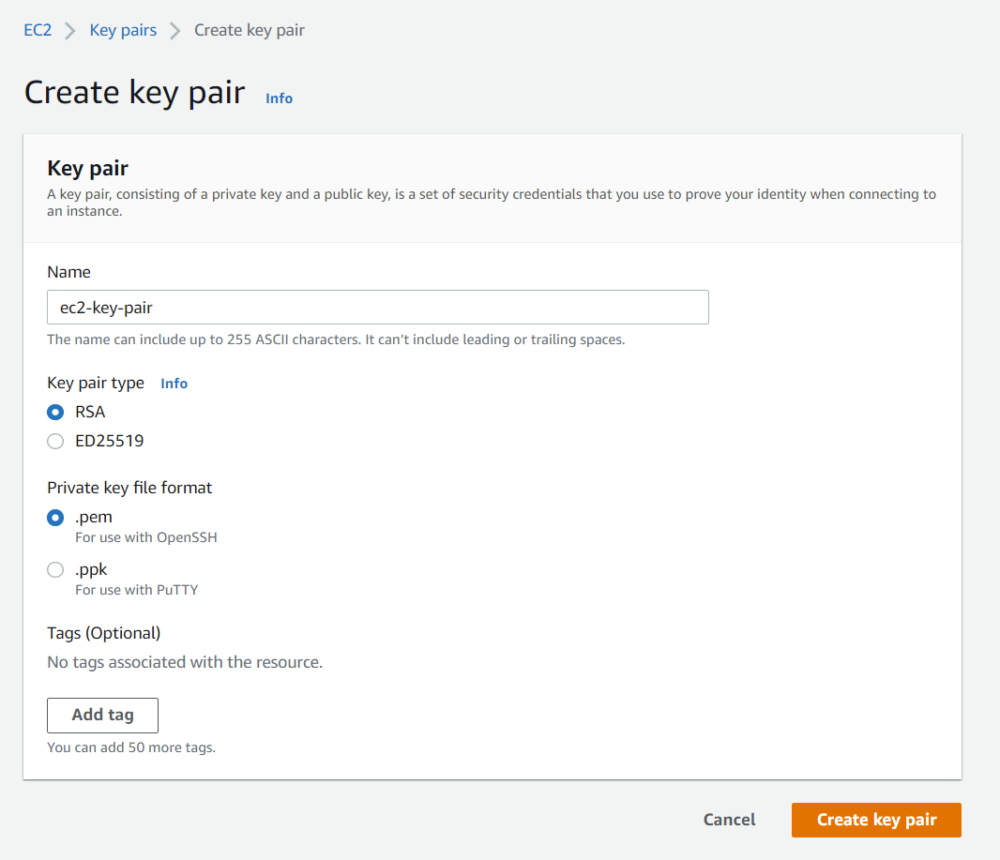

# AWS web queue worker

## Subject

Create an AWS application in which a client submits a request to a worker on EC2. The request is composed of a list of
integers.

The EC2 worker is a Python application that receives the list (the request) and calculates the min, max, mean, median
and send them back to the client.

After sending the response, the EC2 worker must write a log file describing this transaction as txt file on S3 Amazon
Storage Cloud.

Additional details

- the client is limited to 10 numbers. If more numbers are entered, a message error should be sent
- numbers must be positive - again a message error is sent to the client if one of the number is not positive

### Client

Client is composed of 3 files :

#### 1 - `main.py` *runnable*

Entry point of client. Show menu and use CalculationService class to communicate with EC2 worker.

#### 2 - `menu.py` *not runnable*

Function to show menu. Enter integers separated by spaces (max 10), enter quit to exit.

#### 3 - `calculation_serice.py` *not runnable*

This class CalculationService retrieves queues from aws, and contains functions to send and receives messages from queue
in order to get response from ec2 worker.

### EC2 worker

EC2 worker is composed of 3 files :

`instance_creation.py`

#### 1 - `instance_creation.py` *not runnable*

Functions to retrieve key pair and to launch an EC2 instance of type t2.micro and with the image
id `ami-087c17d1fe0178315`, and to create

#### 2 - `launcher.py` *runnable*

Retrieve key pair, and launch t2.micro EC2 instance.

**Please note, you must create a key pair named `ec2-key-pair` (in .pem format) in your AWS console before launching
this script.**

#### 3 - `worker>.py` *runnable*

The script executed on the EC2 instance.

Creates the queues (`requestQueue` and `responseQueue`), retrieves request from queue, make calculation (mean, max,
etc.), create a log in 

